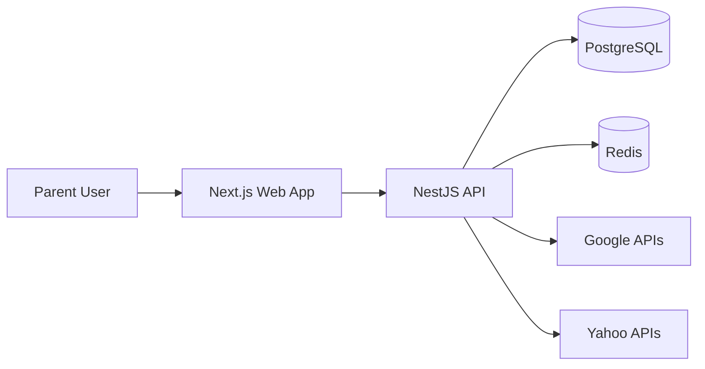
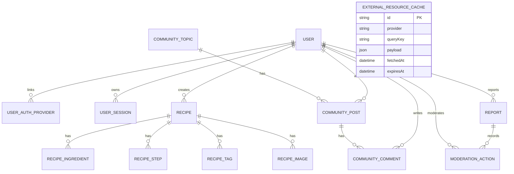

# Baby Bites Platform: Architecture and Implementation Plan

## 1. Product Vision

子育て世代向けに、以下を1つのプロダクトで提供する:

- 月齢・アレルゲンに対応した離乳食レシピ
- 子育て世代のコミュニティ
- 外部サービス（Google/Yahoo）連携による生活支援情報

このドキュメントは、初期実装（MVP）と本番スケールを見据えた設計の基礎を定義する。

## 2. Scope (MVP)

### 2.1 Core Features

- 認証・ユーザー管理
  - Google / LINE OAuth導線
  - 開発用ログイン
  - プロフィール更新、ロール管理（Parent / Moderator / Admin）
- レシピ
  - 一覧取得、詳細取得、投稿
  - 画像アップロード（multipart）
  - 月齢ステージ、調理時間、アレルゲンタグでフィルタ
- コミュニティ
  - トピック一覧
  - 投稿一覧、投稿作成
  - コメント作成
- モデレーション
  - 通報作成
  - モデレーター対応（ステータス更新、対象非表示、ユーザー停止）
- 外部情報
  - 近隣スポット（Google Places API）
  - 子育て関連ニュース検索（Yahoo/Google検索連携用エンドポイント）

### 2.2 Future Extensions

- NGワード自動検知
- 通報優先度自動分類
- 献立自動生成、買い物リスト生成
- 推薦ロジック（月齢 × 栄養バランス × 家族嗜好）

## 3. Tech Stack

- Web: Next.js (App Router), TypeScript, Tailwind CSS
- API: NestJS, TypeScript, Swagger
- DB: PostgreSQL (Prisma ORM)
- Cache/Queue: Redis (将来ジョブ処理に利用)
- Infra Local: Docker Compose

## 4. System Architecture

### 4.1 Principles

- UIはServer Components中心、インタラクション部分のみClient Components
- 外部APIキーはWeb側に露出させず、APIサーバー経由で集約
- APIはRESTベースで開始し、将来GraphQLに拡張可能なモジュール設計

## 5. Domain Model

### 5.1 Entity Overview

- User
- Recipe
- RecipeIngredient
- RecipeStep
- RecipeTag
- RecipeImage
- CommunityTopic
- CommunityPost
- CommunityComment
- UserAuthProvider
- UserSession
- Report
- ModerationAction
- ExternalResourceCache

### 5.2 ER Diagram

## 6. API Design (MVP)

### 6.1 Health

- `GET /health`

### 6.2 Recipes

- `GET /recipes?stage=&allergen=&limit=&offset=`
- `GET /recipes/:id`
- `POST /recipes` (Auth)
- `POST /recipes/:id/images` (Auth, multipart)

### 6.3 Community

- `GET /community/topics`
- `GET /community/posts?topicId=&limit=&offset=`
- `POST /community/posts` (Auth)
- `POST /community/posts/:postId/comments` (Auth)

### 6.4 Auth / Users

- `GET /auth/google/url`
- `GET /auth/line/url`
- `POST /auth/dev-login`
- `POST /auth/oauth-login`
- `GET /auth/me` (Auth)
- `POST /auth/logout` (Auth)
- `GET /users/me` (Auth)
- `PATCH /users/me` (Auth)

### 6.5 Moderation

- `POST /moderation/reports` (Auth)
- `GET /moderation/reports` (Moderator/Admin)
- `PATCH /moderation/reports/:id` (Moderator/Admin)
- `GET /moderation/dashboard` (Moderator/Admin)

### 6.6 Resources (External)

- `GET /resources/nearby?lat=&lng=&keyword=`
- `GET /resources/news?query=`

## 7. External Integration Strategy

### 7.1 Google

- Places API を利用し、近隣の小児科・授乳室・子連れスポットを提供
- APIレスポンスは短時間キャッシュして制限とコストを制御

### 7.2 Yahoo

- Yahoo API群（検索/地図/天気系）を用途に応じて接続
- Provider抽象化によりGoogle/Yahoo切替が可能な実装にする

## 8. Security and Compliance

- APIキーは `.env` 管理（コミット禁止）
- PII（個人情報）は最小化し、ログ出力を抑制
- コミュニティは通報・ブロック前提で設計
- レート制限はPhase 2で導入（Nest Guard + Redis）

## 9. Development Roadmap

### Phase 1 (Current)

- モノレポ構築
- API/DBスキーマ（認証・モデレーション含む）
- レシピ・コミュニティ・外部情報のMVP
- 画像アップロード、通報、モデレーションMVP
- Web UI（Home/Recipes/Community/Resources/Account/Studio/Moderation）

### Phase 2

- Redisキャッシュ強化
- 検索改善（全文検索）
- 通報自動分類、モデレーション支援

### Phase 3

- 献立生成
- 行動ログ分析
- 推薦機能

## 10. Runbook (Local)

1. DockerでPostgreSQL/Redis起動
2. APIでPrisma generate + db push + seed実行
3. Web/APIをそれぞれ開発起動
